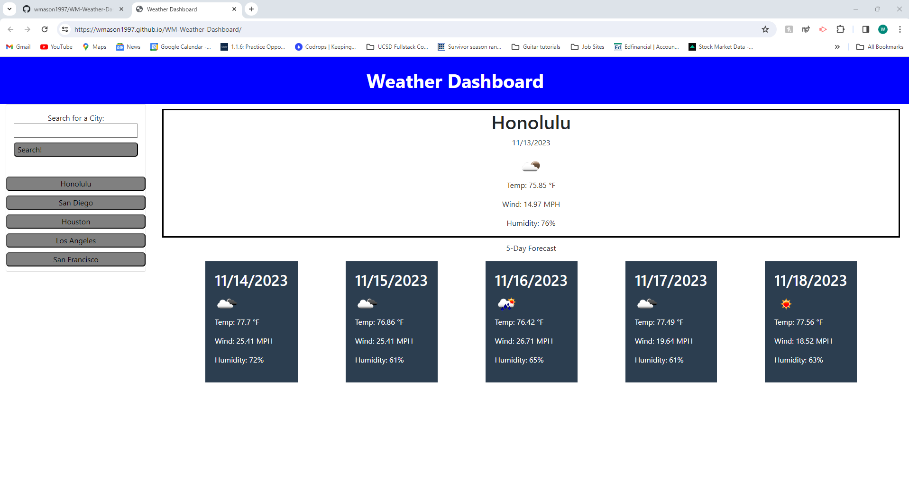

# WM-Weather-Dashboard

## Description ##

This Weather Dashboard was made to practice the use of third-party APIs and Bootstrap. I used the [5 Day Weather Forecast](https://openweathermap.org/forecast5) to retrieve weather data for the city's that the user searched for. I was happy to realize that certain CSS styling and manipulation was coming to me more naturally and required less documentation referencing during this project's development and I am excited to eventually enjoy that level of comfort with this sort of material down the road.

## Credits ## 

Initially, my code was throwing all sorts of errors because I failed to realize that the getWeather call relied on the directGeocode call and I had omitted use of an async function and the await keyword. I had to consult ChatGPT to realize this error and then I referenced [https://developer.mozilla.org/en-US/docs/Web/JavaScript/Reference/Statements/async_function](https://developer.mozilla.org/en-US/docs/Web/JavaScript/Reference/Statements/async_function) to fix it. ChatGPT also helped me to write my isolateAfternoons() function.

I had a tutoring session with Mila Hose on 11/11/2023. Mila helped me with getting the getWeather function to work based on input city name rather than relying on the directGeocode function. Mila also instructed me to use camelCasing wherever possible so I am making an effort to do that in the variable names in the script.js. Mila also helped me to get the date and weather icon to display in the five day forecast with DOM manipulation. Mila helped me to write a renderButtons function so that each previously searched city can be clicked again and have the results display again that utilized localStorage within the directGeocode storage. Thanks Mila!

My use of BootStrap was informed by the 28-Stu_Mini_Project in the 05-Third_Party_APIs in the UCSD-VIRT-FSF-PT-09-2023-U-LOLC GitLab repository. Nirav Venkatesan and Michael Pacheco are the main authors there.

I referenced [https://css-tricks.com/snippets/css/a-guide-to-flexbox/](https://css-tricks.com/snippets/css/a-guide-to-flexbox/) and [https://www.w3schools.com/css/css3_buttons.asp](https://www.w3schools.com/css/css3_buttons.asp) for help with the fiveday display and button stylings.

## Screenshots of Deployed Application ##

## Link to Deployed Application ##
[William's Weather Dashboard](https://wmason1997.github.io/WM-Weather-Dashboard/)